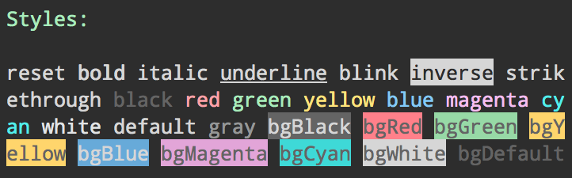

# ansi-styles

> [ANSI escape codes](https://en.wikipedia.org/wiki/ANSI_escape_code#Colors_and_Styles) for styling strings in the terminal

You probably want the higher-level [chalk](https://github.com/chalk/chalk) module for styling your strings.



## Install

```sh
npm install ansi-styles
```

## Usage

```js
import styles from 'ansi-styles';

console.log(`${styles.green.open}Hello world!${styles.green.close}`);


// Color conversion between 256/truecolor
// NOTE: When converting from truecolor to 256 colors, the original color
//       may be degraded to fit the new color palette. This means terminals
//       that do not support 16 million colors will best-match the
//       original color.
console.log(`${styles.color.ansi(styles.rgbToAnsi(199, 20, 250))}Hello World${styles.color.close}`)
console.log(`${styles.color.ansi256(styles.rgbToAnsi256(199, 20, 250))}Hello World${styles.color.close}`)
console.log(`${styles.color.ansi16m(...styles.hexToRgb('#abcdef'))}Hello World${styles.color.close}`)
```

## API

### `open` and `close`

Each style has an `open` and `close` property.

### `modifierNames`, `foregroundColorNames`, `backgroundColorNames`, `underlineColorNames`, and `colorNames`

All supported style strings are exposed as an array of strings for convenience. `colorNames` is the combination of `foregroundColorNames` and `backgroundColorNames`. Underline color names are kept separate in `underlineColorNames`.

This can be useful if you need to validate input:

```js
import {modifierNames, foregroundColorNames} from 'ansi-styles';

console.log(modifierNames.includes('bold'));
//=> true

console.log(foregroundColorNames.includes('pink'));
//=> false
```

## Styles

### Modifiers

- `reset`
- `bold`
- `dim`
- `italic` *(Not widely supported)*
- `underline` - Put a horizontal line below the text. *(Not widely supported)*
- `underlineDouble` - Put a double horizontal line below the text. *(Not widely supported)*
- `underlineCurly` - Put a curly horizontal line below the text. *(Not widely supported)*
- `underlineDotted` - Put a dotted horizontal line below the text. *(Not widely supported)*
- `underlineDashed` - Put a dashed horizontal line below the text. *(Not widely supported)*
- `overline` *Supported on VTE-based terminals, the GNOME terminal, mintty, and Git Bash.*
- `inverse`
- `hidden`
- `strikethrough` *(Not widely supported)*

### Colors

- `black`
- `red`
- `green`
- `yellow`
- `blue`
- `magenta`
- `cyan`
- `white`
- `blackBright` (alias: `gray`, `grey`)
- `redBright`
- `greenBright`
- `yellowBright`
- `blueBright`
- `magentaBright`
- `cyanBright`
- `whiteBright`

### Background colors

- `bgBlack`
- `bgRed`
- `bgGreen`
- `bgYellow`
- `bgBlue`
- `bgMagenta`
- `bgCyan`
- `bgWhite`
- `bgBlackBright` (alias: `bgGray`, `bgGrey`)
- `bgRedBright`
- `bgGreenBright`
- `bgYellowBright`
- `bgBlueBright`
- `bgMagentaBright`
- `bgCyanBright`
- `bgWhiteBright`

### Underline colors

The underline color is set independently of the text color, so the color is only visible when an underline style is also applied. *(Not widely supported)*

Unlike text and background colors, underline colors have no basic 16-color form. Named underline colors and `underlineColor.ansi()` use the first 16 entries of the 256-color palette. `underlineColor.ansi256()` emits a 256-color escape, and `underlineColor.ansi16m()` emits a truecolor escape.

- `underlineBlack`
- `underlineRed`
- `underlineGreen`
- `underlineYellow`
- `underlineBlue`
- `underlineMagenta`
- `underlineCyan`
- `underlineWhite`
- `underlineBlackBright` (alias: `underlineGray`, `underlineGrey`)
- `underlineRedBright`
- `underlineGreenBright`
- `underlineYellowBright`
- `underlineBlueBright`
- `underlineMagentaBright`
- `underlineCyanBright`
- `underlineWhiteBright`

## Advanced usage

By default, you get a map of styles, but the styles are also available as groups. They are non-enumerable so they don't show up unless you access them explicitly. This makes it easier to expose only a subset in a higher-level module.

- `styles.modifier`
- `styles.color`
- `styles.bgColor`
- `styles.underlineColor`

###### Style groups example

```js
import styles from 'ansi-styles';

console.log(styles.color.green.open);
```

The leading SGR parameters of the styles are available under `styles.codes`, which returns a `Map` with the open codes as keys and close codes as values. Parameterized styles such as `4:2` and `58;5;0` are keyed by their leading parameter, `4` and `58` respectively.

###### Style codes example

```js
import styles from 'ansi-styles';

console.log(styles.codes.get(36));
//=> 39
```

## 16 / 256 / 16 million (TrueColor) support

`ansi-styles` allows converting between various color formats and ANSI escapes, with support for 16, 256 and [16 million colors](https://github.com/termstandard/colors).

The following color spaces are supported:

- `rgb`
- `hex`
- `ansi256`
- `ansi`

To use these, call the associated conversion function with the intended output, for example:

```js
import styles from 'ansi-styles';

styles.color.ansi(styles.rgbToAnsi(100, 200, 15)); // RGB to 16 color ansi foreground code
styles.bgColor.ansi(styles.hexToAnsi('#C0FFEE')); // HEX to 16 color ansi foreground code

styles.color.ansi256(styles.rgbToAnsi256(100, 200, 15)); // RGB to 256 color ansi foreground code
styles.bgColor.ansi256(styles.hexToAnsi256('#C0FFEE')); // HEX to 256 color ansi foreground code
styles.underlineColor.ansi(styles.rgbToAnsi(100, 200, 15)); // RGB to underline code using the first 16 palette entries

styles.color.ansi16m(100, 200, 15); // RGB to 16 million color foreground code
styles.bgColor.ansi16m(...styles.hexToRgb('#C0FFEE')); // Hex (RGB) to 16 million color foreground code

styles.underlineColor.ansi256(styles.hexToAnsi256('#C0FFEE')); // HEX to 256 color underline code
styles.underlineColor.ansi16m(...styles.hexToRgb('#C0FFEE')); // Hex (RGB) to 16 million color underline code
```

## Related

- [ansi-escapes](https://github.com/sindresorhus/ansi-escapes) - ANSI escape codes for manipulating the terminal

## Maintainers

- [Sindre Sorhus](https://github.com/sindresorhus)
- [Josh Junon](https://github.com/qix-)
